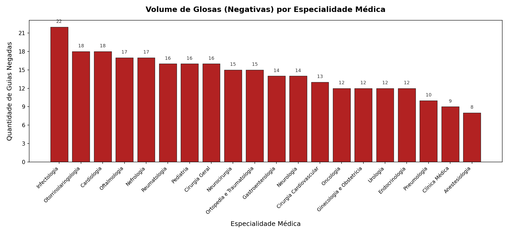
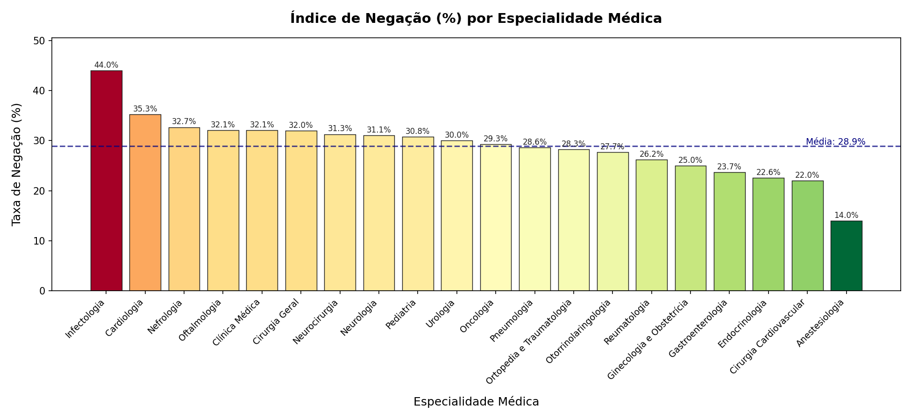

### Auditoria de Autorizações Hospitalares

Projeto de análise de dados aplicado à auditoria em saúde.
Simula o fluxo real de trabalho de um auditor: desde a geração da base de autorizações até a identificação de padrões de glosas por especialidade médica.

---

**Contexto**

Na saúde suplementar, uma glosa é a negativa de pagamento de um procedimento
por parte da operadora de saúde. 
Identificar os procedimentos e especialidades com maior índice de negação é uma atividade estratégica para prestadores, operadoras e auditores.

Este projeto simula esse fluxo usando dados fictícios gerados via código,
com vocabulário técnico real: TUSS, DUT, OPME, CPT, CID e glosa.

---

**Tecnologias utilizadas**

- Python - geração de dados e limpeza
- Pandas - tratamento e análise da base
- Matplotlib - geração de gráficos
- SQLite - consultas analíticas via SQL
- Power BI - dashboard para visualização gerencial

---

**Estrutura do projeto**

PROJETO_AUDITORIA/
├── 1_dados/
│   └── autorizacoes_hospitalares.csv
├── 2_consultas/
│   └── analises.sql
├── 3_graficos/
│   ├── grafico_glosas_volume.png
│   └── grafico_indice_negacao.png
├── gerador_dados.py
├── analise_dados.py
├── analise_graficos.py
└── README.md

**Como executar**
1. Instale as dependências: pip install pandas matplotlib
2. Execute o script principal: python analise_graficos.py
3. Os gráficos serão salvos automaticamente na pasta 3_graficos.

---

### Resultados obtidos

**Procedimentos mais negados**
| Procedimento | Total de Negativas |
|---|---|
| PROC008 | 21 |
| PROC010 | 19 |
| PROC018 | 18 |
| PROC002 | 18 |
| PROC017 | 16 |

**Especialidades com maior ticket médio de glosa**
| Especialidade | Média da Glosa |
|---|---|
| Pneumologia | R$ 10.752,76 |
| Ginecologia e Obstetrícia | R$ 10.489,05 |
| Neurocirurgia | R$ 10.435,69 |
| Reumatologia | R$ 10.430,21 |
| Gastroenterologia | R$ 10.030,11 |

---

### Gráficos

---

## Autor

**Francis Maia**  
Estudante de Sistemas de Informação | Auditoria Hospitalar  
[LinkedIn](https://www.linkedin.com/in/francismaia) 
[GitHub](https://github.com/Francis-maia)